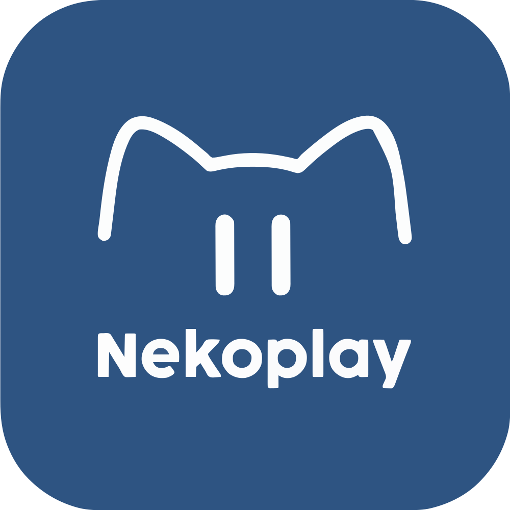
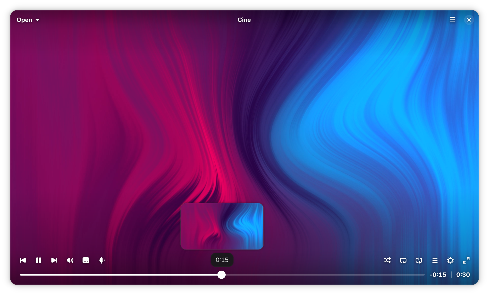
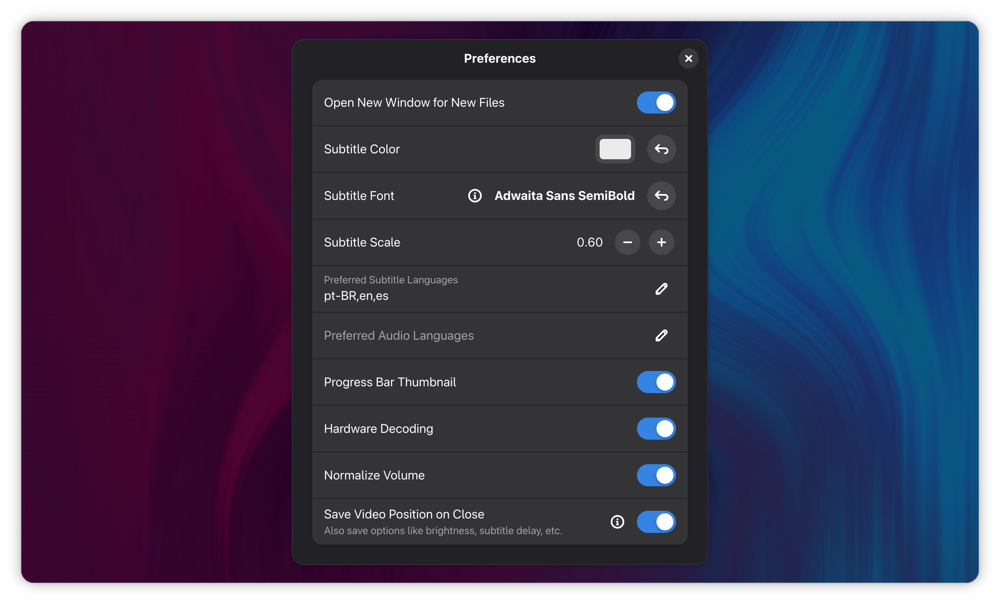
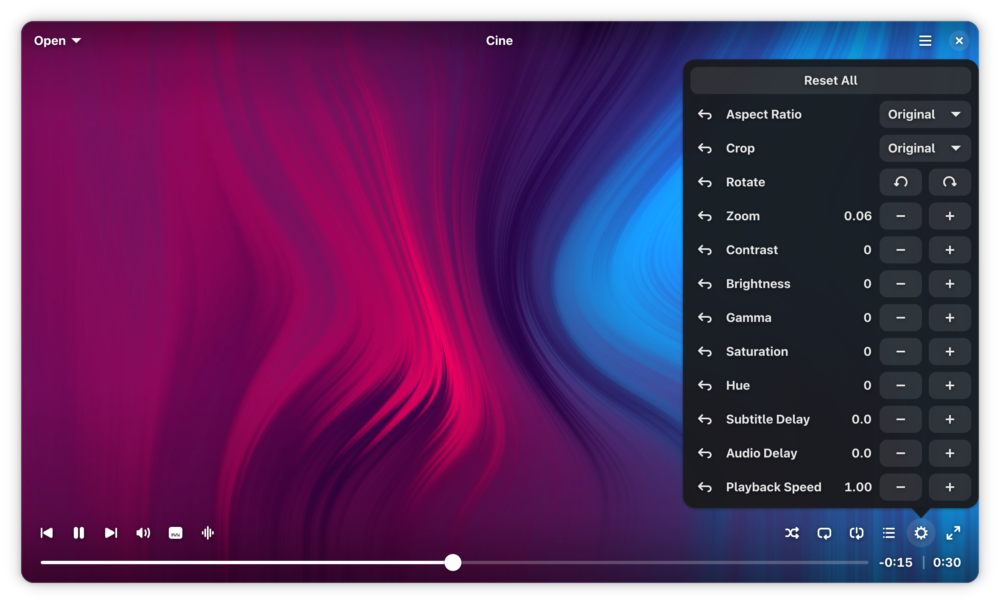
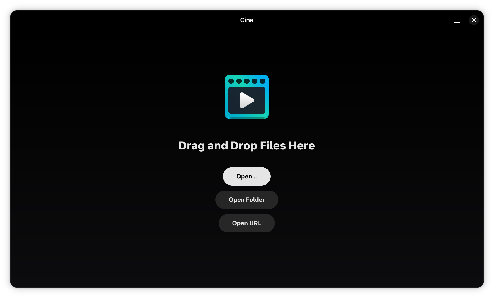

### Nekoplay

Play your 4K animes.

 

### Description

Nekoplay is a fork of [Cine](https://github.com/diegopvlk/Cine) but with a few extra features specifically for anime watching.

### Features

- **Simple Design** — A refined, distraction-free interface
- **MPV-Based** — Leverages the robust power of MPV for great playback and format support
- **Audio and Subtitles** — Control track selection and synchronization for both
- **Video Controls** — Easily adjust brightness, contrast, zoom, aspect ratio, etc.

**Nekoplay specific features**

- **4K Anime upscaling** — Watch in 4K your anime legally downloaded in 720p
- **90s Skip** — Skip openings directly with one button (*most* anime openings are 90s duration)

### Screenshot

  

    
More Screenshots (Expand):
 
      

      

      

  

### Donate

This is a soft fork, most of the hard work has been done by Cine developers, so support them instead.

- [PayPal](https://www.paypal.com/donate?hosted_button_id=DVL7H35GA66X6)
- [Ko-fi](https://ko-fi.com/diegopvlk)
- Pix: diego.pvlk@gmail.com

In case you want to support Nyarch, here is the Nyarch Linux donation button
- [Nyarch Linux Ko-fi](https://ko-fi.com/nyarchlinux)

### Install

You can install from the .flatpak file from latest release on any distribution:

### Build from source

Clone the repo in GNOME Builder and press run.
